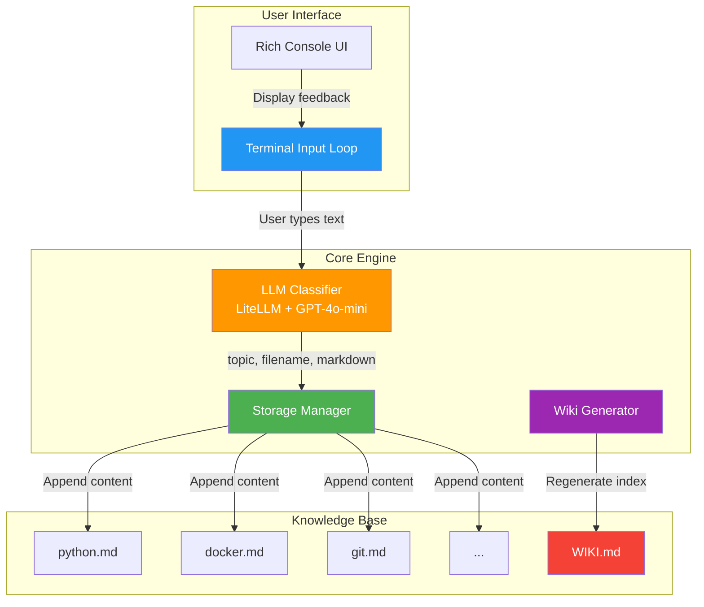
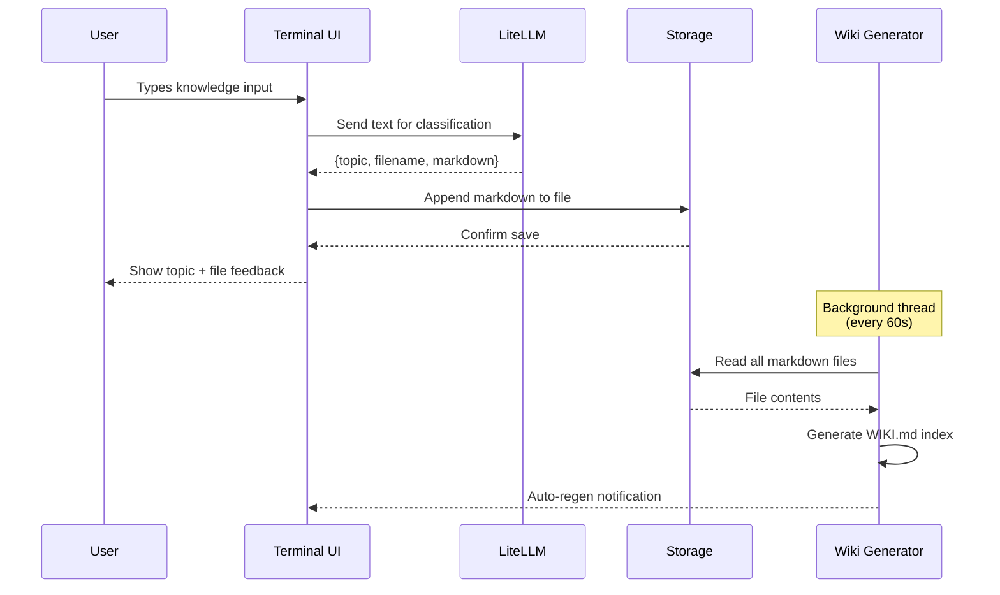
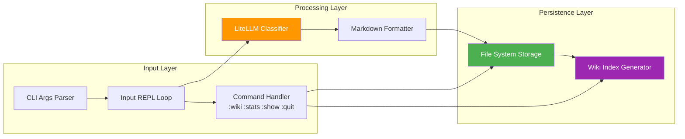

# High-Level Design

## System Overview

The Terminal Knowledge Base Builder is a CLI application that captures user input, classifies it using an LLM, and maintains an organized markdown-based knowledge base with an auto-generated wiki index.

## Data Flow

## Component Interactions

