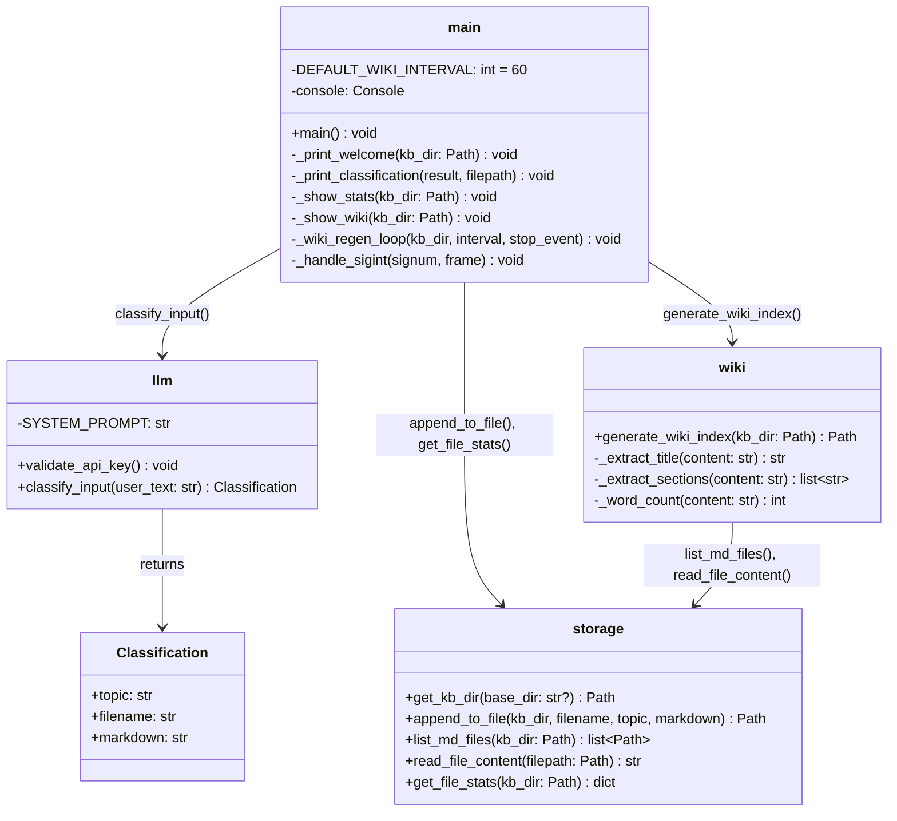
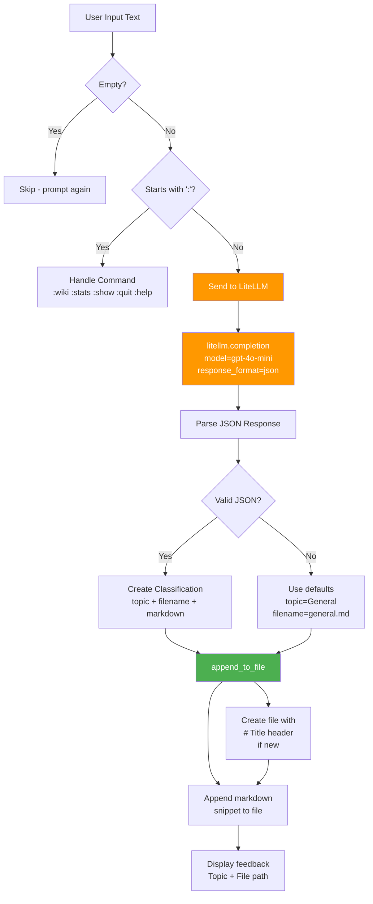
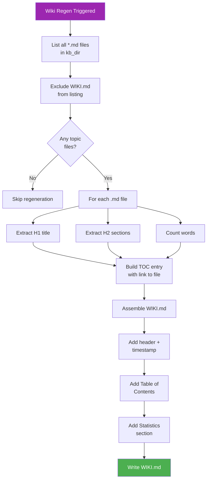
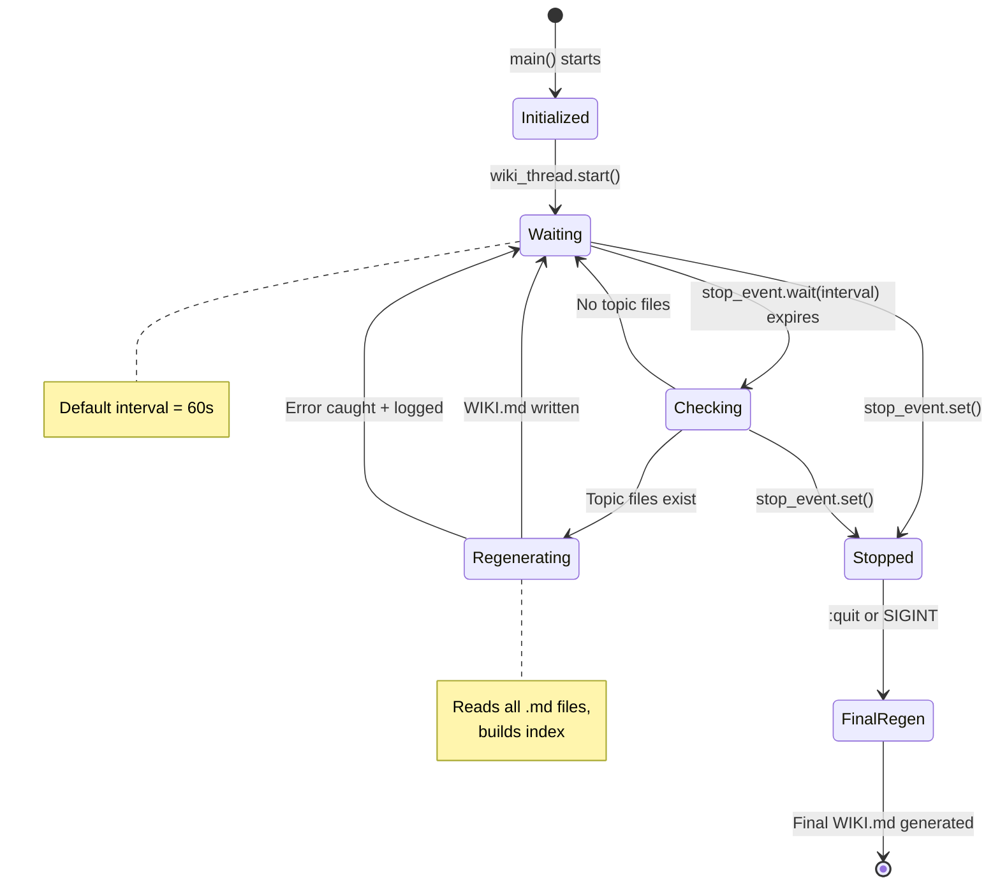
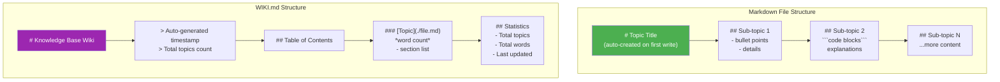

# Low-Level Design

## Module Structure

```mermaid
classDiagram
    class main {
        +main() void
        -_print_welcome(kb_dir: Path) void
        -_print_classification(result, filepath) void
        -_show_stats(kb_dir: Path) void
        -_show_wiki(kb_dir: Path) void
        -_wiki_regen_loop(kb_dir, interval, stop_event) void
        -_handle_sigint(signum, frame) void
        -DEFAULT_WIKI_INTERVAL: int = 60
        -console: Console
    }

    class llm {
        +validate_api_key() void
        +classify_input(user_text: str) Classification
        -SYSTEM_PROMPT: str
    }

    class Classification {
        +topic: str
        +filename: str
        +markdown: str
    }

    class storage {
        +get_kb_dir(base_dir: str?) Path
        +append_to_file(kb_dir, filename, topic, markdown) Path
        +list_md_files(kb_dir: Path) list~Path~
        +read_file_content(filepath: Path) str
        +get_file_stats(kb_dir: Path) dict
    }

    class wiki {
        +generate_wiki_index(kb_dir: Path) Path
        -_extract_title(content: str) str
        -_extract_sections(content: str) list~str~
        -_word_count(content: str) int
    }

    main --> llm : classify_input()
    main --> storage : append_to_file(), get_file_stats()
    main --> wiki : generate_wiki_index()
    llm --> Classification : returns
    wiki --> storage : list_md_files(), read_file_content()
```

## LLM Classification Flow

```mermaid
flowchart TD
    A[User Input Text] --> B{Empty?}
    B -->|Yes| C[Skip - prompt again]
    B -->|No| D{Starts with ':'?}
    D -->|Yes| E[Handle Command<br/>:wiki :stats :show :quit :help]
    D -->|No| F[Send to LiteLLM]

    F --> G[litellm.completion<br/>model=gpt-4o-mini<br/>response_format=json]
    G --> H[Parse JSON Response]
    H --> I{Valid JSON?}
    I -->|Yes| J[Create Classification<br/>topic + filename + markdown]
    I -->|No| K[Use defaults<br/>topic=General<br/>filename=general.md]

    J --> L[append_to_file]
    K --> L
    L --> M[Create file with<br/># Title header<br/>if new]
    L --> N[Append markdown<br/>snippet to file]
    M --> N
    N --> O[Display feedback<br/>Topic + File path]

    style F fill:#FF9800,color:#fff
    style G fill:#FF9800,color:#fff
    style L fill:#4CAF50,color:#fff
```

## Wiki Regeneration Detail

```mermaid
flowchart TD
    A[Wiki Regen Triggered] --> B[List all *.md files<br/>in kb_dir]
    B --> C[Exclude WIKI.md<br/>from listing]
    C --> D{Any topic<br/>files?}
    D -->|No| E[Skip regeneration]
    D -->|Yes| F[For each .md file]

    F --> G[Extract H1 title]
    F --> H[Extract H2 sections]
    F --> I[Count words]

    G --> J[Build TOC entry<br/>with link to file]
    H --> J
    I --> J

    J --> K[Assemble WIKI.md]
    K --> L[Add header +<br/>timestamp]
    L --> M[Add Table of<br/>Contents]
    M --> N[Add Statistics<br/>section]
    N --> O[Write WIKI.md]

    style A fill:#9C27B0,color:#fff
    style O fill:#4CAF50,color:#fff
```

## Background Thread Lifecycle

```mermaid
stateDiagram-v2
    [*] --> Initialized: main() starts

    Initialized --> Waiting: wiki_thread.start()
    Waiting --> Checking: stop_event.wait(interval) expires
    Checking --> Regenerating: Topic files exist
    Checking --> Waiting: No topic files
    Regenerating --> Waiting: WIKI.md written
    Regenerating --> Waiting: Error caught + logged

    Waiting --> Stopped: stop_event.set()
    Checking --> Stopped: stop_event.set()

    Stopped --> FinalRegen: :quit or SIGINT
    FinalRegen --> [*]: Final WIKI.md generated

    note right of Waiting: Default interval = 60s
    note right of Regenerating: Reads all .md files,<br/>builds index
```

## Storage File Format

```mermaid
graph TD
    subgraph "Markdown File Structure"
        A["# Topic Title<br/>(auto-created on first write)"]
        B["## Sub-topic 1<br/>- bullet points<br/>- details"]
        C["## Sub-topic 2<br/>```code blocks```<br/>explanations"]
        D["## Sub-topic N<br/>...more content"]
    end

    subgraph "WIKI.md Structure"
        E["# Knowledge Base Wiki"]
        F["> Auto-generated timestamp<br/>> Total topics count"]
        G["## Table of Contents"]
        H["### [Topic](./file.md)<br/>*word count*<br/>- section list"]
        I["## Statistics<br/>- Total topics<br/>- Total words<br/>- Last updated"]
    end

    A --> B
    B --> C
    C --> D

    E --> F
    F --> G
    G --> H
    H --> I

    style A fill:#4CAF50,color:#fff
    style E fill:#9C27B0,color:#fff
```
